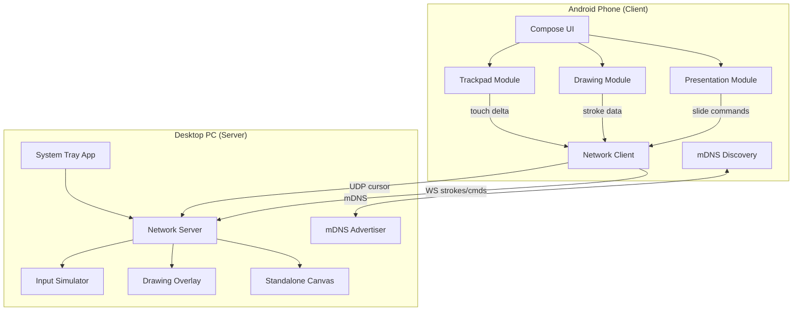
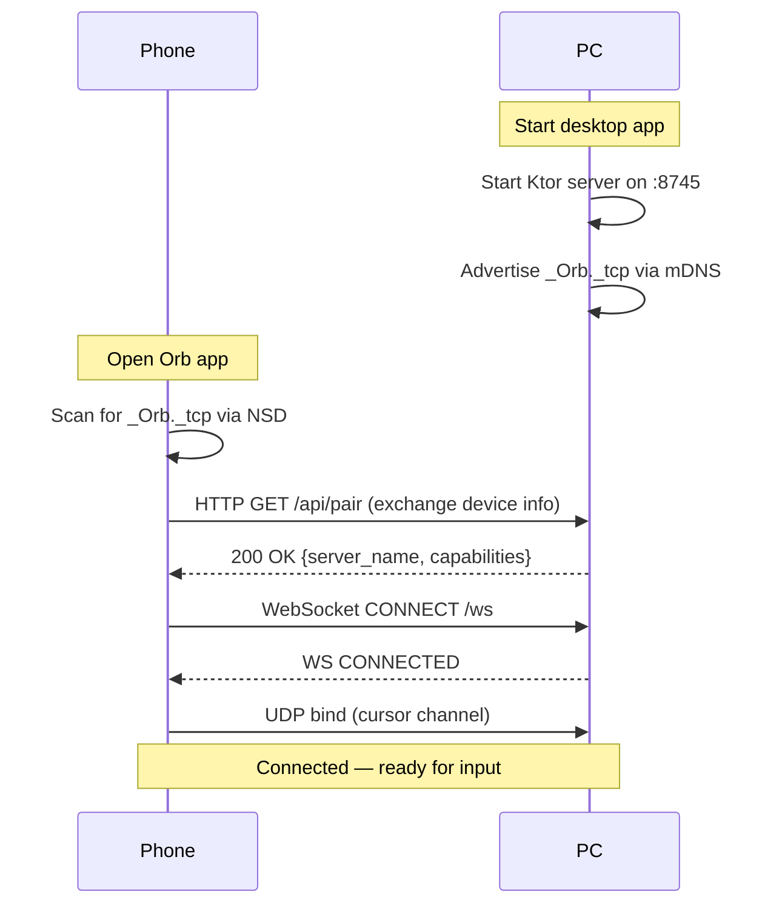

# Orb — Master Engineering Document

> **Your phone is the Orb that controls everything.** Wireless trackpad, presentation remote, AND drawing/writing tablet for your PC.

> Combines the best of [Mousely](https://github.com/Mouse-ly) (trackpad + presentation) with [PenSync](https://github.com/ankitraj2234/PenSync) / [Weylus](https://github.com/H-M-H/Weylus) (drawing pad) into one app.

---

## Table of Contents

1. [Existing Open-Source Landscape](#1-existing-open-source-landscape)
2. [Product Requirements (PRD)](#2-product-requirements-prd)
3. [Technical Requirements (TRD)](#3-technical-requirements-trd)
4. [System Architecture](#4-system-architecture)
5. [Technical Approach](#5-technical-approach)
6. [Data Flow & Protocols](#6-data-flow--protocols)
7. [Module Breakdown](#7-module-breakdown)
8. [Build & Run Instructions](#8-build--run-instructions)
9. [Project Structure](#9-project-structure)
10. [Risk Matrix](#10-risk-matrix)
11. [Roadmap](#11-roadmap)

---

## 1. Existing Open-Source Landscape

Before building, here's what already exists and why none of them fully solve your problem:

| Project | What it does | Platform | Drawing Pad? | Trackpad? | Windows? | Status |
|---|---|---|---|---|---|---|
| [**Mousely**](https://github.com/Mouse-ly/mousely-android-app) | Wireless trackpad + presentation remote | Android → macOS | ❌ No | ✅ Yes | ❌ macOS only | Active |
| [**PenSync**](https://github.com/ankitraj2234/PenSync) | Phone as wireless pen display | Android → Windows | ✅ Yes | ❌ No | ✅ Yes | Early stage |
| [**Weylus**](https://github.com/H-M-H/Weylus) | Phone/tablet as drawing tablet via browser | Any browser → Linux/macOS/Win | ✅ Yes | ❌ No | ✅ Yes | Unmaintained |
| [**InkBridge**](https://github.com/dagaza/InkBridge) | Android as digitizer | Android → Linux | ✅ Yes | ❌ No | ❌ Linux only | Active |
| **SuperDisplay** | Phone as second screen + pen input | Android → Windows | ✅ Yes | ✅ Yes | ✅ Yes | Paid / Proprietary |

> [!IMPORTANT]
> **No single open-source project combines trackpad + presentation remote + drawing pad + Windows support.**
> That's why we build Orb.

### Recommended "Just Install Now" Option

If you want something working **today** while we build Orb:

- **For drawing pad only (Windows):** Install [PenSync](https://github.com/ankitraj2234/PenSync) — free, open-source, Android → Windows
- **For trackpad only (macOS):** Install [Mousely](https://mouse.ly/) from the App Store
- **For everything (paid):** [SuperDisplay](https://superdisplay.app/) — $10, works great

---

## 2. Product Requirements (PRD)

### 2.1 Vision

Orb is a free, open-source app that turns any Android phone into a **wireless input device** for Windows/macOS PCs. It combines three modes:

1. **Trackpad Mode** — phone screen acts as a touchpad to move PC cursor
2. **Drawing Pad Mode** — phone screen is a canvas; strokes appear on PC in real-time (like Apple Pencil on iPad)
3. **Presentation Remote Mode** — control slides, laser pointer, volume

### 2.2 Users

| User | Need |
|---|---|
| Student | Write notes on phone → text appears on PC screen for recording/annotation |
| Designer | Quick sketches using phone as a Wacom-style tablet |
| Presenter | Control slides wirelessly from phone |
| General user | Use phone as wireless mouse/trackpad |

### 2.3 Functional Requirements

#### FR-01: Wireless Trackpad
- Single-finger touch → cursor movement (relative positioning)
- Two-finger scroll (vertical + horizontal)
- Tap = left click, two-finger tap = right click
- Three-finger swipe = switch desktops / app switcher
- Sensitivity slider (adjustable DPI)

#### FR-02: Drawing/Writing Pad
- Full-screen canvas on phone
- Pen tool with adjustable thickness and color
- Eraser tool
- Pressure sensitivity support (for devices with active stylus like S Pen)
- Real-time stroke streaming to PC desktop
- PC-side overlay window (transparent canvas on top of all apps)
- PC-side canvas window (standalone whiteboard)
- Undo/redo
- Clear canvas
- Save drawing as PNG/SVG on PC

#### FR-03: Presentation Remote
- Next slide / Previous slide
- Start/stop presentation
- Laser pointer (cursor highlight on PC)
- Timer display on phone
- Volume control

#### FR-04: Connection
- Auto-discovery via mDNS/Bonjour on same Wi-Fi network
- Manual IP entry fallback
- QR code pairing
- USB connection fallback (via ADB port forwarding)
- Connection status indicator
- Auto-reconnect on drop

#### FR-05: Settings
- Dark/light theme
- Left-handed mode
- Haptic feedback toggle
- Sensitivity adjustments
- Custom gesture mapping

### 2.4 Non-Functional Requirements

| Requirement | Target |
|---|---|
| Latency (Wi-Fi) | < 20ms touch-to-cursor |
| Latency (USB) | < 5ms touch-to-cursor |
| Drawing stroke lag | < 30ms phone-to-PC render |
| Battery drain | < 5% per hour active use |
| APK size | < 15 MB |
| Desktop app size | < 30 MB |
| Supported Android | 8.0+ (API 26+) |
| Supported PC | Windows 10/11, macOS 12+ |

---

## 3. Technical Requirements (TRD)

### 3.1 Tech Stack

```
┌────────────────────────────────────┐
│         ANDROID APP (Client)       │
│                                    │
│  Language:    Kotlin                │
│  UI:         Jetpack Compose       │
│  Networking: Ktor Client / OkHttp  │
│  Discovery:  NSD (Android mDNS)    │
│  Canvas:     Android Canvas API    │
│  Haptics:    Android Vibrator API  │
│  Build:      Gradle (KTS)          │
│  Min SDK:    26 (Android 8.0)      │
└────────────────────────────────────┘
         │ WebSocket (binary frames)
         │ UDP (low-latency cursor)
         ▼
┌────────────────────────────────────┐
│       DESKTOP APP (Server)         │
│                                    │
│  Language:    Kotlin/JVM            │
│  UI:         Compose Multiplatform │
│  Networking: Ktor Server           │
│  Discovery:  JmDNS                 │
│  Input Sim:  java.awt.Robot (JVM)  │
│              + JNI for Win32 API   │
│  Overlay:    Transparent JFrame    │
│  Build:      Gradle (KTS)          │
│  Packaging:  jpackage / GraalVM    │
└────────────────────────────────────┘
```

### 3.2 Why Kotlin/Compose Multiplatform?

- **Same language** for Android and Desktop (shared models, shared protocol logic)
- **Compose Multiplatform** gives native desktop UI on Windows/macOS
- **Ktor** runs on both client and server sides
- **No Electron bloat** — native JVM desktop app, ~20MB packaged

### 3.3 Alternative: Web-Based Desktop (Lighter Build)

If JVM is too heavy for your taste, the desktop side can be:

```
Desktop Alternative:
  - Node.js + WebSocket server
  - Electron or Tauri for overlay window
  - robotjs for input simulation
  - Lighter to prototype, heavier at runtime (Electron)
  - Tauri = Rust backend + WebView, ~5MB binary
```

> [!TIP]
> **Recommended first implementation**: Tauri (Rust) for desktop + Kotlin for Android. Tauri gives a tiny binary, native performance, and the WebView overlay is trivial to implement.

### 3.4 Protocol Requirements

| Data Type | Transport | Format | Rate |
|---|---|---|---|
| Cursor movement | UDP | Binary (8 bytes: dx, dy as float32) | 60-120 Hz |
| Click/gesture events | WebSocket | JSON or MessagePack | On event |
| Drawing strokes | WebSocket | Binary (stroke point array) | 60 Hz batched |
| Presentation commands | WebSocket | JSON | On event |
| Connection/pairing | TCP (HTTP) | JSON | Once |
| File transfer (save drawing) | TCP (HTTP) | Binary (PNG) | On demand |

---

## 4. System Architecture



---

## 5. Technical Approach

### Phase 1: Core Transport Layer (Week 1-2)

**Goal**: Phone sends touch data → PC moves cursor.

1. **Desktop server**:
   - Start Ktor embedded server on port `8745`
   - Advertise via JmDNS as `_Orb._tcp`
   - Accept UDP packets for cursor movement
   - Accept WebSocket connections for commands
   - Use `java.awt.Robot` to move mouse, simulate clicks

2. **Android client**:
   - Discover server via NSD (Network Service Discovery)
   - Capture touch events on a blank `Canvas` composable
   - Calculate touch delta (dx, dy) per frame
   - Send via UDP at 60Hz
   - Send click/gesture events via WebSocket

3. **Binary cursor protocol** (8 bytes per frame):
   ```
   [0-3] float32 dx (relative X movement)
   [4-7] float32 dy (relative Y movement)
   ```

4. **Gesture detection on Android**:
   - Single tap → left click
   - Two-finger tap → right click
   - Two-finger drag → scroll
   - Three-finger swipe → desktop switch
   - Long press → drag mode

### Phase 2: Drawing Pad (Week 3-4)

**Goal**: Phone canvas → real-time strokes on PC.

1. **Android drawing canvas**:
   - `Canvas` composable with `Path` rendering
   - Capture: x, y, pressure, timestamp per touch point
   - Smooth with Catmull-Rom or cubic Bézier interpolation
   - Batch points (every 16ms) and send via WebSocket

2. **Stroke data format** (per point, 20 bytes):
   ```
   [0-3]   float32  x (normalized 0.0-1.0)
   [4-7]   float32  y (normalized 0.0-1.0)
   [8-11]  float32  pressure (0.0-1.0)
   [12-15] uint32   timestamp_ms
   [16-17] uint16   stroke_id
   [18]    uint8    event (0=move, 1=down, 2=up)
   [19]    uint8    tool (0=pen, 1=eraser)
   ```

3. **WebSocket message envelope**:
   ```json
   {
     "type": "stroke_batch",
     "points": [/* binary array */],
     "color": "#FF0000",
     "width": 3.0
   }
   ```
   For performance, use pure binary frames with a 1-byte type header.

4. **PC overlay rendering**:
   - **Transparent JFrame** (Java): `setBackground(new Color(0, 0, 0, 0))`, always-on-top
   - **Tauri alternative**: transparent, click-through WebView window
   - Render incoming strokes using Canvas2D or Skia
   - Toggle between "overlay" (transparent, click-through) and "canvas" (solid, interactive)

### Phase 3: Presentation Remote (Week 5)

**Goal**: Slide control + laser pointer.

1. **Slide commands**: Map to keyboard shortcuts
   - Next → `Right Arrow` or `Page Down`
   - Previous → `Left Arrow` or `Page Up`
   - Start → `F5`
   - End → `Escape`

2. **Laser pointer**: Bright colored circle overlay following touch position (absolute mapping)

3. **Timer**: Local countdown timer on phone screen

### Phase 4: Polish & Packaging (Week 6)

- System tray integration (desktop)
- Auto-start on boot option
- One-click installer (Windows: MSI/NSIS, macOS: DMG)
- Android APK distribution (GitHub Releases + F-Droid)
- QR code pairing flow
- Settings persistence

---

## 6. Data Flow & Protocols

### Connection Flow



### Trackpad Data Flow (Low Latency)

```
Phone touch → calculate delta → UDP packet → PC receives → Robot.mouseMove()
         ↓                                                       ↓
    16ms interval                                          < 5ms processing
```

### Drawing Data Flow

```
Phone touch → capture point → batch (16ms) → WS binary frame → PC receives
                                                                     ↓
                                                              Render on overlay
                                                              (Canvas2D / Skia)
```

---

## 7. Module Breakdown

### Android App Modules

```
app/
├── core/
│   ├── network/
│   │   ├── DiscoveryManager.kt      # mDNS service discovery
│   │   ├── WebSocketClient.kt       # Ktor WebSocket client
│   │   ├── UdpSender.kt             # UDP cursor data sender
│   │   └── ConnectionState.kt       # Connection state machine
│   ├── protocol/
│   │   ├── CursorPacket.kt          # Binary cursor protocol
│   │   ├── StrokePacket.kt          # Binary stroke protocol
│   │   └── CommandPacket.kt         # JSON command protocol
│   └── settings/
│       └── AppSettings.kt           # DataStore preferences
├── trackpad/
│   ├── TrackpadScreen.kt            # Main trackpad UI
│   ├── TrackpadViewModel.kt         # Touch → delta calculation
│   └── GestureDetector.kt           # Multi-touch gesture recognition
├── drawing/
│   ├── DrawingScreen.kt             # Drawing canvas UI
│   ├── DrawingViewModel.kt          # Stroke management
│   ├── DrawingCanvas.kt             # Custom Canvas composable
│   ├── StrokeEngine.kt              # Bézier smoothing, pressure
│   └── ToolPalette.kt               # Pen/eraser/color picker
├── presentation/
│   ├── PresentationScreen.kt        # Remote control UI
│   ├── PresentationViewModel.kt     # Slide command logic
│   └── TimerWidget.kt               # Countdown timer
└── ui/
    ├── theme/                        # Material 3 theme
    ├── navigation/                   # Bottom nav / mode switcher
    └── components/                   # Shared UI components
```

### Desktop App Modules

```
desktop/
├── server/
│   ├── OrbServer.kt              # Ktor embedded server
│   ├── WebSocketHandler.kt          # WS message routing
│   ├── UdpListener.kt               # UDP cursor receiver
│   └── ServiceAdvertiser.kt         # JmDNS advertisement
├── input/
│   ├── InputSimulator.kt            # Interface
│   ├── WindowsInputSimulator.kt     # Win32 API via JNI/JNA
│   ├── MacInputSimulator.kt         # CGEvent via JNI
│   └── RobotInputSimulator.kt       # java.awt.Robot fallback
├── overlay/
│   ├── DrawingOverlay.kt            # Transparent overlay window
│   ├── OverlayRenderer.kt           # Skia/Canvas2D stroke renderer
│   └── LaserPointer.kt              # Laser pointer circle
├── canvas/
│   ├── StandaloneCanvas.kt          # Standalone whiteboard window
│   └── CanvasExporter.kt            # Save as PNG/SVG
├── tray/
│   ├── SystemTrayManager.kt         # System tray icon + menu
│   └── NotificationManager.kt       # Connection notifications
└── shared/
    ├── protocol/                     # Shared with Android (KMP)
    └── models/                       # Shared data classes
```

---

## 8. Build & Run Instructions

### Prerequisites

```
- JDK 17+
- Android Studio Ladybug+ (for Android app)
- Gradle 8.x
- Android device (API 26+) or emulator
- Windows 10/11 or macOS 12+ (for desktop)
```

### Quick Start

```powershell
# Clone the repo
git clone https://github.com/YOUR_USERNAME/Orb.git
cd Orb

# Build & run desktop server
./gradlew :desktop:run

# Build Android APK
./gradlew :android:assembleDebug

# Install APK on connected device
adb install android/build/outputs/apk/debug/android-debug.apk

# USB mode (port forwarding)
adb reverse tcp:8745 tcp:8745
```

### Running

1. Launch the desktop app → system tray icon appears → server starts
2. Open Orb on phone → auto-discovers desktop on same Wi-Fi
3. Tap to connect → choose mode (Trackpad / Drawing / Presentation)
4. For USB: run `adb reverse tcp:8745 tcp:8745`, then use "USB Mode" in app

---

## 9. Project Structure

```
Orb/
├── android/                    # Android app (Kotlin + Compose)
│   ├── src/main/
│   ├── build.gradle.kts
│   └── ...
├── desktop/                    # Desktop app (Kotlin + Compose Multiplatform)
│   ├── src/main/
│   ├── build.gradle.kts
│   └── ...
├── shared/                     # Shared Kotlin Multiplatform module
│   ├── src/commonMain/         # Protocol, models, serialization
│   ├── src/androidMain/
│   ├── src/jvmMain/
│   └── build.gradle.kts
├── build.gradle.kts            # Root build script
├── settings.gradle.kts
├── gradle.properties
└── README.md
```

---

## 10. Risk Matrix

| Risk | Impact | Probability | Mitigation |
|---|---|---|---|
| Wi-Fi latency spikes | Drawing feels laggy | Medium | UDP for cursor; batch strokes; USB fallback |
| `java.awt.Robot` limitations on Windows | Some inputs not simulated correctly | Medium | JNI/JNA to Win32 `SendInput()` API |
| Overlay transparency issues on Windows | Drawing overlay not click-through | Medium | Use `WS_EX_LAYERED` + `WS_EX_TRANSPARENT` via JNA |
| Pressure sensitivity unavailable | No pressure data from finger touch | High (most phones) | Simulate pressure from touch radius; real pressure only with stylus |
| Android battery drain from constant touch streaming | Users complain | Low | Throttle to 60Hz; use efficient binary protocol |
| macOS security permissions | Accessibility permission required | High | Clear permission request dialog; documentation |
| Firewall blocks connection | Can't connect | Medium | USB fallback; clear firewall instructions |

---

## 11. Roadmap

### v0.1 — MVP (6 weeks)
- [x] UDP cursor streaming (trackpad mode)
- [x] WebSocket connection management
- [x] Basic gesture detection (tap, scroll, right-click)
- [x] mDNS discovery
- [x] Desktop system tray
- [ ] Drawing canvas with real-time streaming
- [ ] Drawing overlay on PC
- [ ] Presentation remote (next/prev/start/stop)

### v0.2 — Polish (4 weeks)
- [ ] QR code pairing
- [ ] USB mode via ADB
- [ ] Pressure sensitivity (S Pen / active stylus)
- [ ] Settings persistence
- [ ] Dark/light theme
- [ ] Haptic feedback
- [ ] Windows installer (MSI)

### v0.3 — Advanced (4 weeks)
- [ ] Standalone whiteboard mode on PC
- [ ] Save/export drawings (PNG, SVG)
- [ ] Custom gesture mapping
- [ ] Multi-monitor support
- [ ] Keyboard input from phone
- [ ] Text OCR from handwriting (stretch goal)

### v1.0 — Release
- [ ] F-Droid listing
- [ ] macOS DMG
- [ ] Windows Microsoft Store
- [ ] iPad companion app (iOS)
- [ ] Documentation site

---

## Quick Reference: Key Repos to Study

| Repo | What to learn from it |
|---|---|
| [Mouse-ly/mousely-android-app](https://github.com/Mouse-ly/mousely-android-app) | Android trackpad UI, touch-to-cursor mapping, gesture detection |
| [Mouse-ly/mousely-macos-app](https://github.com/Mouse-ly/mousely-macos-app) | Desktop server architecture, mDNS, input simulation on macOS |
| [ankitraj2234/PenSync](https://github.com/ankitraj2234/PenSync) | Android → Windows pen display, drawing protocol, Win32 input |
| [H-M-H/Weylus](https://github.com/H-M-H/Weylus) | Browser-based drawing tablet, uinput (Linux), WebSocket streaming |
| [AnyDeskVN/Weylus](https://github.com/AnyDeskVN/Weylus) | Fork with Windows support improvements |
| [dagaza/InkBridge](https://github.com/dagaza/InkBridge) | Modern drawing tablet protocol, pressure/tilt, Linux HID |

---

> [!NOTE]
> This document is the single source of truth for the Orb project. All implementation should reference this for architecture decisions, protocol formats, and module boundaries.
