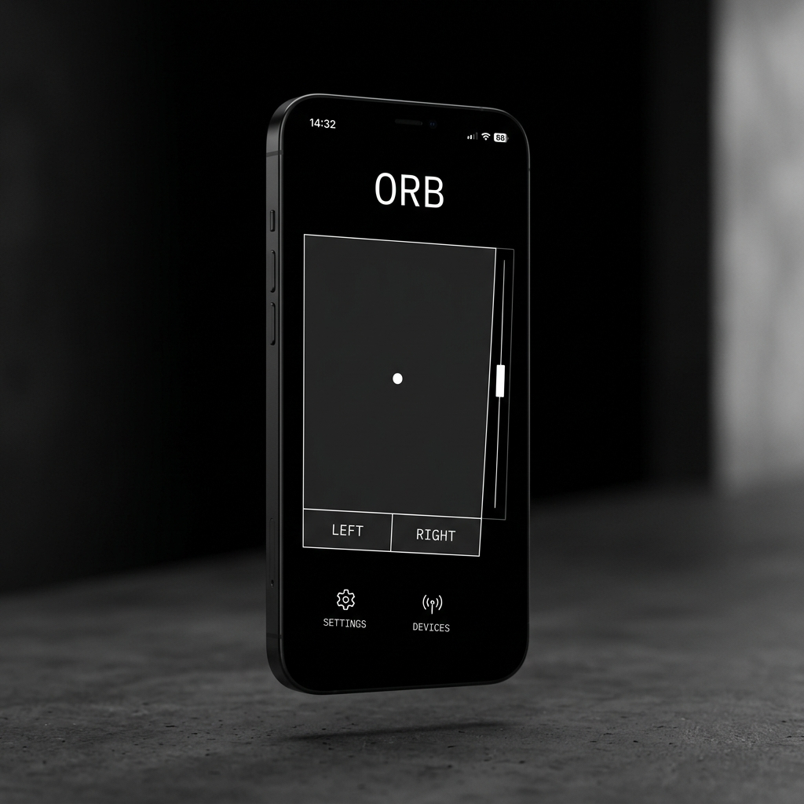

# Orb

A local, low-latency cross-platform controller that transforms any smartphone or tablet into a wireless PC trackpad, presentation remote, and drawing tablet. 



## Core Architecture

Orb uses a lightweight WebSockets (Socket.IO) and Flask architecture hosted on the target PC, serving a Progressive Web App (PWA) client to mobile devices on the same local network. 

This eliminates the need for App Store approvals, client-side installations, or native iOS/Android codebases.

### Tech Stack
- **Server:** Python 3.10+, Flask, Flask-SocketIO, Eventlet
- **OS Integration:** PyAutoGUI (Mouse/Keyboard control), PyQt5 (Transparent click-through canvas overlay)
- **Client:** HTML5, JS, Socket.IO client, CSS (PWA)

## Features

1. **Trackpad**
   - High-fidelity touch-to-mouse coordinate mapping.
   - Tap-to-click.
   - Dedicated edge scroll-zone.
2. **Drawing Pad**
   - Mirrors mobile touch paths directly onto a transparent PyQt5 canvas covering the PC screen.
   - Useful for whiteboarding during presentations or screen shares.
3. **Remote Control**
   - Left/Right keyboard simulation (mapped to Arrow Keys / Space / F5) for controlling PowerPoint, Keynote, and web slides.

## 🚀 Quick Start (No Python Required)

The easiest way to use Orb on Windows is to download the standalone executable. No terminal or Python installation is required.

1. Go to the [Releases tab](../../releases) on GitHub.
2. Download `OrbServer.exe`.
3. Double-click to run it. It runs silently in the background and will pop up a window showing you the IP address to connect to on your phone.

---

## 🛠 Developer Installation

If you want to run Orb from the source code:

Ensure you have Python 3.10+ installed.

```bash
git clone https://github.com/atharveeee-netizen/orb.git
cd orb
python -m venv venv
.\venv\Scripts\activate  # On Windows
pip install -r requirements.txt
```

## Usage

1. Start the server on your PC:
   ```bash
   python server.py
   ```
2. The console will output the local network IP (e.g., `http://192.168.1.100:8745`).
3. Navigate to that IP on your mobile device browser.
4. **Optional (For Native Feel):** Add the page to your Home Screen to launch it as a full-screen standalone PWA without browser UI.

## Specifications

Detailed Product Requirements and Technical Approaches can be found in `.spec/PRD.md`.
